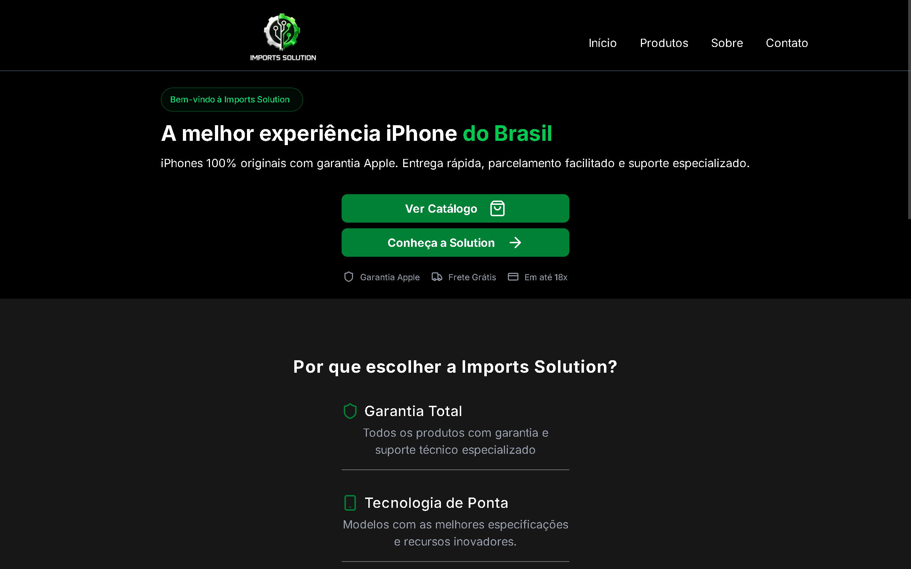
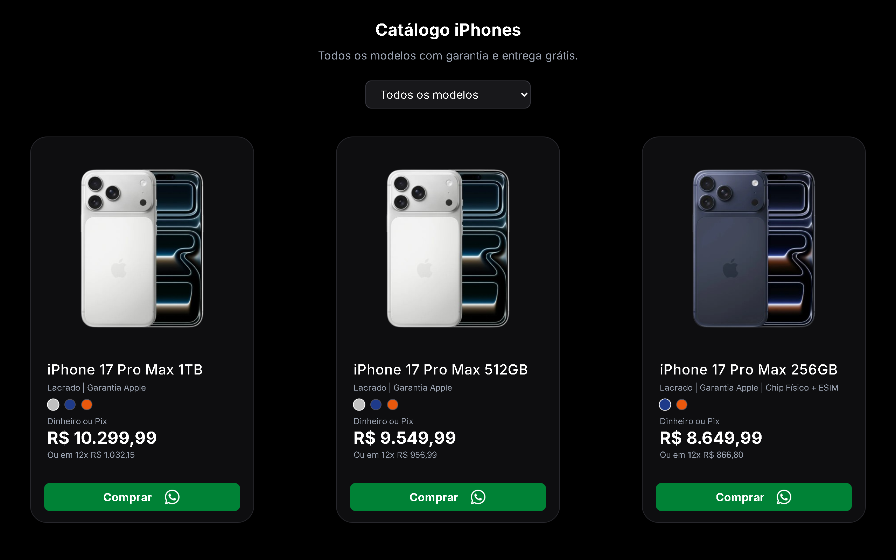
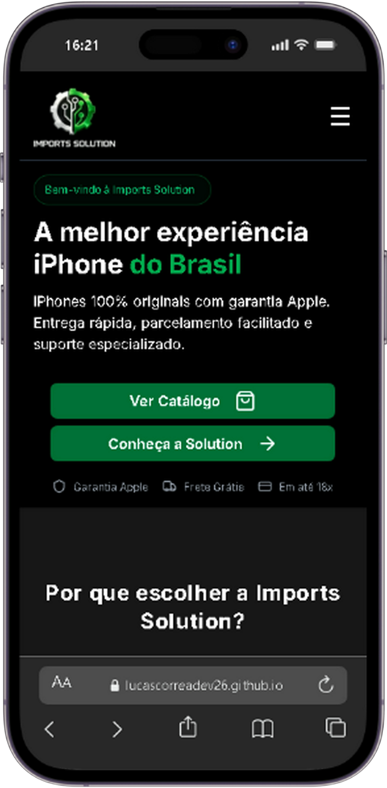
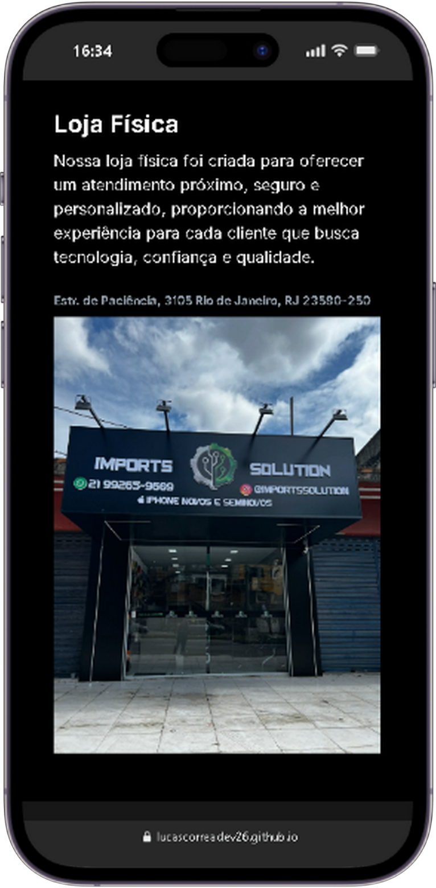
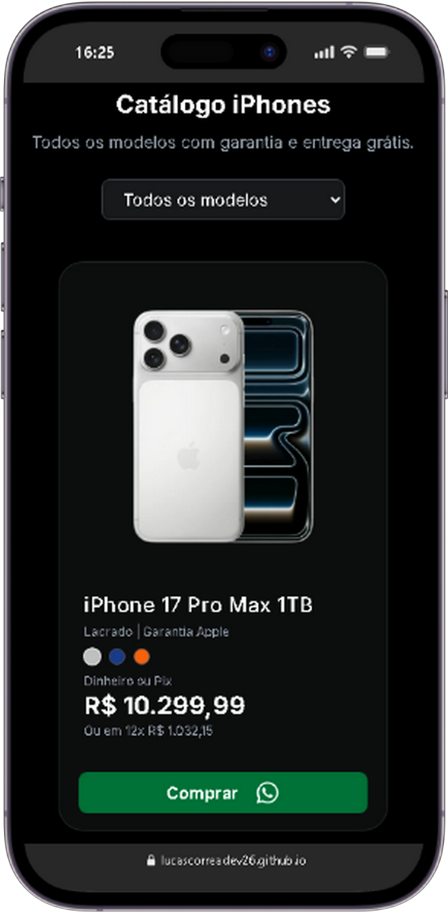

# 📱 Imports Solution - Catálogo de iPhones

Catálogo digital de iPhones com integração direta via WhatsApp.

---

# Sobre o projeto

Projeto desenvolvido para apresentar um catálogo digital de iPhones, permitindo que clientes visualizem os modelos disponíveis de forma simples, organizada e responsiva.

A Imports Solution é uma loja especializada em smartphones e produtos apple.

Este projeto foi criado como um MVP, com o objetivo de digitalizar o catálogo da loja e facilitar o atendimento ao cliente através de uma experiência moderna e intuitiva.

Link do projeto: https://lucascorreadev26.github.io/imports-solution/
---

# Funcionalidades

- Listagem de produtos
- Filtro por modelo de iPhone
- Cards com imagem, nome, descrição e preço
- Organização dos iPhones por modelo
- Interface responsiva
- Integração direta com WhatsApp
- Design moderno
- Navegação simples e intuitiva
- Estrutura preparada para futuras melhorias

---

# ⚙ Tecnologias utilizadas

- React
- JavaScript
- Tailwind CSS
- Git e GitHub

---

# Preview do Projeto

## Página Inicial

  

---

## Catálogo de Produtos

  

---

# Responsividade

  

  
  
  

---

# Objetivo do projeto

O objetivo principal é substituir o catálogo manual da loja, oferecendo uma experiência mais prática para o cliente visualizar os produtos disponíveis.

O projeto também busca facilitar o atendimento e aumentar a presença digital da loja.

---

# Melhorias futuras

- Busca por nome
- Página individual do produto
- Painel administrativo
- Cadastro de produtos
- Controle financeiro
- Dashboard com métricas

---

# Status do projeto

Projeto em desenvolvimento (MVP)

Novas funcionalidades estão sendo adicionadas progressivamente.

---

# 👨‍💻 Autor

Desenvolvido por Lucas Correa.